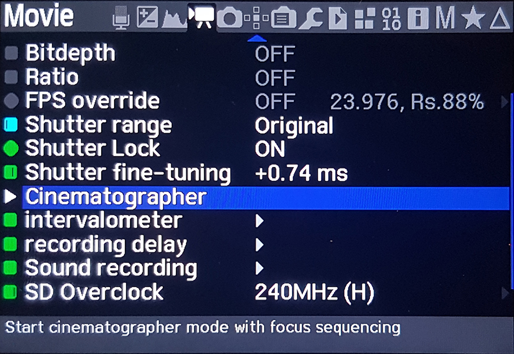
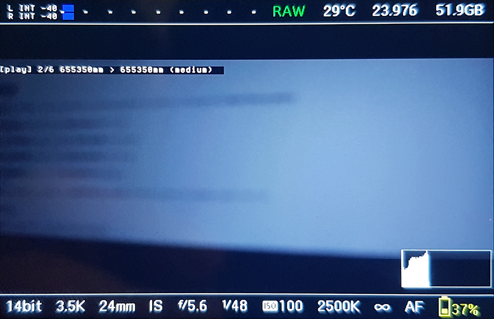
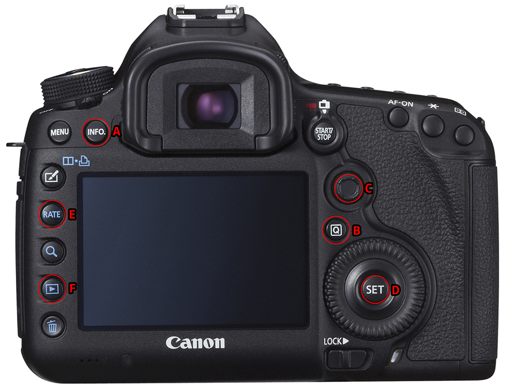

# Cinematographer mode

## 1. Purpose

*Cinematographer mode* is a [Magic Lantern](https://magiclantern.fm/) **module** helping to solve the following situations:

- We cannot use an external *focus puller monitor* because we're recording videos using **crop modes**, which are currently incompatible with the camera *HDMI output*
- We're recording videos as a **single camera operator** without the assistance of a *focus puller* and the sequence is too complex to deal with *manual focusing*

👉 *Cinematographer mode* provides then a way to easily **record multiple lens focus points**, so we can prepare a sequence including camera or target movements and subsequently **replay** them as we're recording videos, using a simple push button to switch to a point to the next one in the sequence.

> **Typical use case**: I'm a *single camera operator* recording a video using *crop modes* and my sequence is a combination of a *dolly-in* movement (with a speed ramp) and a horizontal camera rotation used to keep an object at the center of the composition.
>
> 👉 While I'm rehearsing the camera track and movements, I'll record three or four intermediate focus points in a sequence with proper speed transition settings, so my targeted object is always perfectly focused and I'll replay the focus sequence while I'm finally recording the scene, going forward from a focus point to the next one by pushing a single button.

## 2. How to build ?

If we want to build the module ourselves, we basically need to follow [these instructions](https://www.magiclantern.fm/forum/index.php?topic=20214.0) if we're under the **Windows 10** operating system, relying over [WSL](https://en.wikipedia.org/wiki/Windows_Subsystem_for_Linux).

We need first to [install a Linux subsystem](https://learn.microsoft.com/fr-fr/windows/wsl/install), which can be done running the following command under *PowerShell*:

```bash
wsl --install
```

The first time, we will have to register some credentials and reboot.

To configure the ***Magic Lantern* build environment**, we will have to execute the following commands:

```bash
sudo apt-get update
sudo apt-get install make gcc gcc-arm-none-eabi mercurial gcc-mingw-w64 python3-docutils zip
sudo apt-get install python2
```

Then we have to *clone* a ***Magic Lantern* repository**, for example [the one maintained by Danne](https://bitbucket.org/Dannephoto/magic-lantern_dannephoto_git/src/master/) containing the code base of the ***crop_rec_4k_mlv_snd_isogain_1x3_presets*** fork of *Magic Lantern*:

```bash
git clone https://bitbucket.org/Dannephoto/magic-lantern_dannephoto_git.git
```

To add and build the *cinematographer mode* **module**, we basically need to follow [these instructions](https://www.magiclantern.fm/forum/index.php?topic=19232.0), which can be summarized with the following command sequence:

- Adding a "*cinemato*" module folder with one header and one source files:

```bash
cd magic-lantern_dannephoto_git/modules/
mkdir cinemato
cd cinemato
touch cinemato.c
touch module_strings.h
```

- Copying and altering a *Makefile* from an existing module:

```bash
cp ../ettr/Makefile .
sed -i "s/ettr/cinemato/" Makefile
```

Now we just have to replace both "***cinemato.c***" and "***module_strings.h***" file content with the one provided in the */cinemato/* folder of this *git* repository, then build the module using the following command line:

```bash
make
```

If all the planets are well aligned, we must see a "***cinemato.mo***" module file appears in the folder.

## 3. How to install ?

We can use the pre-built "***cinemato.mo***" module provided in the */cinemato/* folder of this *git* repository.

> ⚠ Please note this module was currently only tested on a ***Canon 5D mark 3*** camera with ***1.1.3*** firmware (*5D3.113* target).

To install the module:

- Copy the "***cinemato.mo***" module file to the **camera SD card** in the ***/ML/modules/*** folder
- Start the camera and enter *Magic Lantern* menu (using the [***trashcan***] button)
- Go to the "**Modules**" menu and load ([***SET***] button) the **cinematographer** module
- Re-start the camera

We may have a new "***cinematographer***" option in the *Magic Lantern*'s **Movie** menu.



## 4. How to use ?

To use the *Cinematographer mode*, we just need to **start it** by selecting the "*cinematographer*" option in the *Magic Lantern*'s **Movie** menu.

Then, we may see the following display's **overlay** on the very left side of the screen (*40pixels from the top*):

```
[idle]
```

Which is indicating the *Cinematographer mode* is waiting to be enabled.

👆 In order to **enable** (or subsequently **disable**) the *Cinematographer mode*, we just need to press the [***INFO***] button.

> ⚠ Enabling the *Cinematographer mode* will hook a lot of camera keys (like the *joystick*) so we need to think about disabling it manually in some situations (like recovering other *Magic Lantern* functionalities).
>
> 👉 Note the *Cinematographer mode* is automatically disabled (both *overlays* and *camera key hooks*) when we're entering the *Magic Lantern*'s menus.

When enabled we may see a new overlay content, depending of the current **focus sequence mode** (***PLAY*** by default).

👆 We can toggle between ***PLAY*** and ***EDIT*** modes by pressing the [***Q***] button.



### 4.1. Lens focus change

In both ***PLAY*** and ***EDIT*** *focus sequence modes*, we can use the camera *joystick* in order to change the **lens focus point**:

- 👆 [***JOYSTICK_UP***] button will **slowly** (*step by step*) **decrease** the focus
- 👆 [***JOYSTICK_DOWN***] button will **slowly** (*step by step*) **increase** the focus
- 👆 [***JOYSTICK_RIGHT***] button will **quickly** (*step of 10*) **decrease** the focus
- 👆 [***JOYSTICK_LEFT***] button will **quickly** (*step of 10*) **increase** the focus

> Using *Cinematographer mode* the lens itself must be in **autofocus mode** and we need to always take care of:
>
> - never do **manual focus** operations
> - never doing **autofocus** (*half-press shutter*, in most of the cases)
>
> In both cases, *Magic Lantern* will lose its internal relative focus step reference and focus sequencing will be fucked up.

For convenience, we can use the 👆 [***JOYSTICK_CENTER***] button to (de)active the *focus change by joystick*, typically in order to recover native *Magic Lantern*'s functions attached to the joystick.

When activated, we can see a "**{focus}**" indication displayed on the screen overlay, e.g.:

```
[edit] 0 < 450mm (fastest) {focus}
```

👉 Note also the [***ZOOM***] button will be our best friend here, allowing us to temporarily get a magnified vision of the scene that is precise enough to visually ensure our focus is perfectly positioned.

### 4.2. Edit mode

Each time we're switching to ***EDIT*** *focus sequence mode*, the focus sequence itself is **reset** and the camera display overlay will look like this:

```
[edit] 0 < 450mm (fastest) {focus}
```

Indicating:

- The current **recorded point count** *{1}*
- The current **lens distance** (mm) *to be queued* *{2}*
- The current **transition speed** *to be queued* *{3}*
- If **focus by joystick** is currently active *{4}*

Under the form:

```
[edit] {1} < {2}mm ({3}) {{4}}
```

The **lens distance** indication is dynamically updated regarding our **lens focus change** operations, providing an information about the point that will be **queued next in the list**, alongside the **lens focus transition speed** that will be used to go from the previous focus point in the list to this new one.

👆 Use the [***SET***] button to **queue** the current *lens position* and *selected transition speed* in the **focus sequence**.

👆 Using the [***RATE***] button, we can cycle around **transition speed** presets to select one before queuing: possible speed values are currently ***fastest***, ***fast***, ***medium***, ***slow*** and ***slowest***, corresponding respectively to the addition of a *0ms*, *10ms*, *50ms*, *100ms* and *200ms* delay between two focus rotation steps during the focus lens transition.

### 4.3. Play mode

Each time we're switching to ***PLAY*** *focus sequence mode*, the camera display overlay will look like this:

```
[play] 3/3 200mm > 450mm (fastest) {focus}
```

Indicating:

- The current **focus index** in the sequence *{1}*
- The current **sequence length** *{2}*
- The current **lens distance** (mm) *{3}*
- The **lens distance** (mm) of the **next focus point** in the sequence *{4}*
- The **transition speed** that will be used to do the transition from current focus point to the next one *{5}*
- If **focus by joystick** is currently active *{6}*

Under the form:

```
[play] {1}/{2} {3}mm > {4}mm ({5}) {{6}}
```

👆 To run the **focus transition** between the current point in the list to the next one, we just need to press the [***SET***] button.

When reaching the latest position in the sequence list, it loops naturally to its very beginning, allowing us to retrieve our initial focus position (and repeating the sequence again).

During the transition, the camera display the following overlay:

```
[play] 1>2 870mm (slow)
```

Indicating:

- The **source focus index** in the sequence *{1}*
- The **target focus index** in the sequence *{2}*
- The current **lens distance** (mm) *{3}* that will dynamically change during transition
- The current **transition speed** in use *{4}*

Under the form:

```
[play] {1}>{2} {3}mm ({4})
```

### 4.4. Battery saver

👆 One additional feature we may want to use is the [***PLAY***] button that allows to quickly toggle the **camera display on** and **off**, disabling it being a huge **battery saver**, particularly when dealing with video in **crop modes** (the *framed* display really drains the battery).

### 4.5. Save and reload

Anytime we're *adding focus points to the sequence* or we're *changing the focus index value*, both data are **saved to disk** in a dedicated **settings file** (*/ML/SETTINGS/cinemato.cfg*).

When starting the *Cinematographer mode*, the settings file is **reloaded**, so you can continue to work in the exact same conditions as before the camera was shut downed.

## 5. Summary



👆 (A) [***INFO***] **enable/disable** the *Cinematographer mode*

👆 (B) [***Q***] toggle between ***PLAY*** and ***EDIT*** focus sequence modes

👆 (C) [***JOYSTICK***] increase or decrease *lens focus point*, use [***JOYSTICK_CENTER***] to (de)activate focus change by joystick

👆 (D) [***SET***] **queue** the current *lens position* and *selected transition speed* in the focus sequence in ***EDIT* mode**, run the **focus transition** between the current point in the list to the next one in ***PLAY* mode**

👆 (E) [***RATE***] cycle around **transition speed** presets

👆 (F) [***PLAY***] toggle the **camera display on** and **off**

## 6. License and credits

The *Cinematographer mode* module for *Magic Lantern* is provided under the [GPLv3 licensing model](https://www.gnu.org/licenses/gpl-3.0.en.html).

Thanks to *`Audionut11`* (from *r/MagicLantern*), *`WalterSchulz`* & *`?❄? names_are_hard ?❄?`* (from *Magic Lantern discord channel*) and of course *`a1ex`*, *`Danne`*, *`thebilalfakhouri`* plus all the amazing *Magic Lantern* contributors for the hard work!